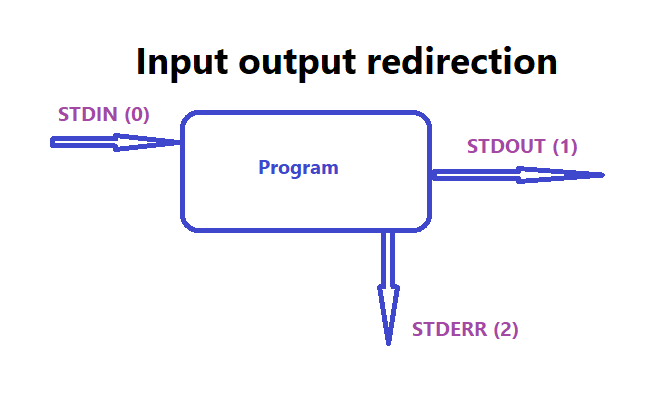

# I/O redirection



Every program has 3 types that are connected to it:

1. **STDIN(0)** - standard input.
2. **STDOUT(1)** - standard output.
3. **STDERR(2)** - standard error.

- Redirect **STDOUT(1)** to a file:

```bash
raya@raya-VirtualBox:~/Desktop/Lesson10$ ls
a.txt  try.bash
raya@raya-VirtualBox:~/Desktop/Lesson10$ ls > MyOutput
raya@raya-VirtualBox:~/Desktop/Lesson10$ echo "Hello user!" > SecOutput
```

- Append the **STDOUT(1)** to the file. (if exists).

```bash
ls >> SecOutput
```

1. `command 1>filename` - redirect the **STDOUT(1)** to the file.

2. `command 1>>filename` - redirect the **STDOUT(1)** to the file, and append to the end of the file.

3. `command-error 1>filename` - that will print the error to the terminal.

4. `command-error 2>filename` - redirects the **STDERR(2)** to filename.

5. `command-error 2>>filename` - redirects the **STDERR(2)** to filename, and append to the end of the file.

6. `jgdlsgk &>file` - redirect both **STDOUT(1)** and **STDERR(2)** to file. 
